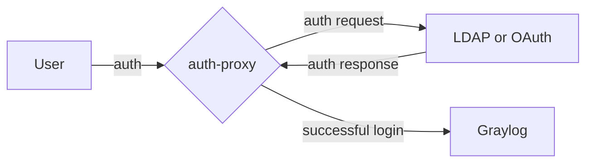

Graylog-auth-proxy is a service that syncs users from an SSO provider (such as Active Directory) with
users in Graylog. The service works as a reverse proxy for the Graylog server.

# Table of Contents

* [Table of Contents](#table-of-contents)
* [Supported deploy schemes](#supported-deploy-schemes)
* [How it works](#how-it-works)
* [Installation](#installation)
  * [Connecting to LDAP](#connecting-to-ldap)
    * [Storing of LDAP bind password](#storing-of-ldap-bind-password)
    * [LDAP over SSL](#ldap-over-ssl)
    * [LDAP with STARTTLS](#ldap-with-starttls)
    * [Configuration examples for LDAP mode](#configuration-examples-for-ldap-mode)
  * [Connecting to OAuth authorization server](#connecting-to-oauth-authorization-server)
    * [Integration with Keycloak](#integration-with-keycloak)
      * [Keycloak configuration](#keycloak-configuration)
      * [Proxy configuration](#proxy-configuration)
      * [Configuration examples for integration with Keycloak](#configuration-examples-for-integration-with-keycloak)
    * [Storing of OAuth Client Secret](#storing-of-oauth-client-secret)
    * [OAuth service with TLS](#oauth-service-with-tls)

# Supported deploy schemes

Currently, graylog-auth-proxy supports as SSO provider only LDAP (or AD) server.

# How it works

During working process graylog-auth-proxy connects to an SSO provider and handles all requests that are going to the
Graylog server. If user wants to access to the Graylog UI via the proxy, they need to enter credentials for a user
from SSO provider. Then the proxy verifies these creds and adds user with the same username and random password
to Graylog and gives him the rights (attaches roles and shares several streams) based on the proxy configuration and
some attributes of the user from SSO provider. If the proxy is integrated with OAuth service, the credentials
are verified on the OAuth server side. If the user is already exist in the Graylog, graylog-auth-proxy tries
to update it.

After successful authentication graylog-auth-proxy adds a trusted header with the username to each request that goes to
Graylog to avoid internal Graylog authentication. The proxy connect to LDAP or OAuth server only once
and then uses cookies to identify users for better performance. That mechanism work until cookies expired.

Regardless of this, the proxy runs the script for rotation of random passwords for users created in the Graylog and
deleting users that no longer exist in the SSO provider. This script runs every few days (3 days by default).

Also, graylog-auth-proxy have a metrics endpoint `/metrics` with Prometheus metrics.



# Installation

You can deploy the `graylog-auth-proxy` as part of the Graylog container with the `logging-operator`.
In this document, we will talk about the features of the configuration and installation of the `graylog-auth-proxy`.
You can see more information about the deployment of the logging-operator in general
[in the installation guide](/docs/installation.md).

You must set `.Values.graylog.authProxy.install` to `true` to allow installation. In addition, you need to
configure several parameters to properly connect to the SSO provider (e.g. to LDAP or OAuth server).
You can find the list of parameters in the [installation guide](../installation.md#graylog-auth-proxy).

## Connecting to LDAP

If you want to use LDAP as an SSO provider, you have to specify parameter `authType` as `ldap`.

Then you have to specify a several mandatory parameters to connect to LDAP (or AD) server:

* `url` - URL of LDAP server
* `baseDn` - base DN for users that will be synchronized with the corresponding users in the Graylog
* `bindDn` - DN for LDAP user that will be used to connect to LDAP and query other users by using `baseDn`
* `bindPassword` or `htpasswd` - password for user specified by `bindDn` configured as plaintext in
  the `bindPassword` parameter or as path to htpasswd file with password stored on the VM in the `htpasswd` parameter
* `searchFilter` - LDAP template for query. Default value is used for OpenLDAP. If you want to use Active Directory
  you can set `(SAMAccountName=%(username)s)` as value of the parameter

Also, you can specify unnecessary parameters which can be used for detailed configuration of the connection to LDAP and
details of synchronization between LDAP and Graylog users:

* `roleMapping` - configuration that describes the proxy how to match Graylog roles and groups of LDAP users
* `streamMapping` - similar configuration as `role_mapping` that allows to share Graylog streams to users based on
  the user's membership in LDAP group
* `rotationPassInterval` - interval in days between password rotation for users in Graylog except those who
  specified in the `pre_created_users` parameter
* `preCreatedUsers` - names of users separated by commas for whom will not work password rotation

Let's take a closer look at the configuration of the proxy and how it works.

When you enter username and password from LDAP user to the basic auth form, the proxy tries to find user with the same
username in LDAP server at address stored in the `url` on the DN, specified in the `baseDn` parameter.
Search is conducted on behalf of the user specified in the `bindDn` parameter. Also, the proxy should know password
for this user. This password can be set in 2 different ways:

1. As plain text in the `bindPassword` parameter
2. (*recommended*) You can create htpasswd file that contains password encoded in Base64. Path to this file on VM
   should be specified in the `htpasswd` parameter

Also, you should set correct `searchFilter` if needed. Usually you can use the default value `(cn=%(username)s)` for
OpenLDAP server or `(SAMAccountName=%(username)s)` value for Active Directory server.

---

If you want to configure matching between Graylog users and LDAP users based on attribute `memberOf` from LDAP, you
should specify `roleMapping` parameter in the following format:

```bash
"<group_CN_1>":["<role_x>","<role_y>"] | "<group_CN_2>":["<role_z>"] | ["<role_default>"]
```

The last set of roles will be used if the user doesn't match any of specified groups.

For example, the following configuration:

```bash
"CN=otrk_admins,OU=OTRK_Groups,OU=IRQA_LDAP,DC=testad,DC=local":["Admin"] | "CN=otrk_users,OU=OTRK_Groups,OU=IRQA_LDAP,DC=testad,DC=local":["Reader","Operator"] | ["Reader"]
```

will match this cases:

* LDAP users who are members of group with CN `CN=otrk_admins,OU=OTRK_Groups,OU=IRQA_LDAP,DC=testad,DC=local`
  will have role `Admin` in the Graylog
* LDAP users who are members of group with CN `CN=otrk_users,OU=OTRK_Groups,OU=IRQA_LDAP,DC=testad,DC=local`
  will have roles `Reader` and `Operator` in the Graylog
* Users who are not members of groups above will have role `Reader`

Note that the order in which groups are specified matters. If user is a member of two or more groups that specified in
the configuration, the first one will be chosen.

You can find available roles or create your own on the Graylog interface: `System -> Roles`.

---

Stream sharing for Graylog users is configured in a similar way:

```bash
"<group_CN_1>":["<stream_name_x>/<access_level_x>","<stream_name_y>/<access_level_y>"] | "<group_CN_2>":["<stream_name_z>"] | ["<stream_name_default>/<access_level_default>"]
```

where access level can take values `view`, `manage` and `own`. If the access level is not specified, `view` capability
will set by default.

For example, the following configuration:

```bash
"CN=otrk_admins,OU=OTRK_Groups,OU=IRQA_LDAP,DC=testad,DC=local":["All messages/manage","all events/view"] | "CN=otrk_users,OU=OTRK_Groups,OU=IRQA_LDAP,DC=testad,DC=local":["All events"] | ["System logs/view"]
```

will match this cases:

* Stream with name `All messages` with capability `Manager` and stream `All events` with capability `Viewer` will be
  shared for each LDAP user who is members of group
  with CN `CN=otrk_admins,OU=OTRK_Groups,OU=IRQA_LDAP,DC=testad,DC=local`
* Stream with name `All events` with default capability `Viewer` will be shared for each LDAP user who is members of
  group with CN `CN=otrk_users,OU=OTRK_Groups,OU=IRQA_LDAP,DC=testad,DC=local`
* Users who are not members of groups above will have access to stream `System logs` with capability `Viewer`

The order in which groups are specified matters just as for the role mapping. Names of streams are case-insensitive.

**Please, do not forget to put quotes and other punctuation marks in the same way as it is done in the examples.**

---

The proxy creates corresponding users in the Graylog for each user that logged in the Graylog via the proxy
at least once. These users are created with random passwords.

The graylog-auth-proxy consists of HTTP server that handles requests and redirects them to Graylog, and the separate
script for rotation Graylog passwords for created users and deleting those that no longer exists in LDAP.

This part runs on a schedule at intervals of several days. The interval can be specified in the
`rotationPassInterval` parameter (3 days by default).

This script run for each user, no matter it was created by the proxy or not. But you can exclude users from the
rotation by adding those names to the `preCreatedUsers` parameter. The following users will be excluded by default:
`admin,auditViewer,operator,telegraf_operator,graylog-sidecar,graylog_api_th_user`, where `admin` is the default
root user for Graylog UI and others - technical users for internal usage.

If you want to add your own users to this list, **please, do not remove any of default users from it**. It means that
you if you want to add `user_1` and `user_2`, you should specify the `preCreatedUsers` parameter like that:

```yaml
admin,auditViewer,operator,telegraf_operator,graylog-sidecar,graylog_api_th_user,user_1,user_2
```

Otherwise, this can lead to unpredictable consequences.

### Storing of LDAP bind password

You must set password for LDAP bind user specified in the `ldap.bindDN` parameter as value of the `ldap.bindPassword`
parameter during deploy for correct LDAP connection. In this case, the password will be stored in the Secret with
the name that specified in `ldap.bindPasswordSecret.name` parameter (`graylog-auth-proxy-secret` by default) at the key
that specified in `ldap.bindPasswordSecret.key` parameter (`bindPassword` by default).

The `ldap.bindPasswordSecret` parameter uses `v1.SecretKeySelector` structure.
See [Kubernetes docs](https://kubernetes.io/docs/reference/generated/kubernetes-api/v1.24/#secretkeyselector-v1-core)
to figure out how to customize this parameter.

**Note:** Bind password will be encoded in Base64 twice. It means that the password will be **double encoded**
in the Secret. This is required due to the way graylog-auth-proxy works.

### LDAP over SSL

If your LDAP server has a port with an ability to connect to it with SSL encryption, you should prefer an LDAP over SSL
instead of insecure LDAP connection.

The main path to configure the proxy to connect to LDAP over SSL is almost the same as in the previous section.

Differences in the configuration between insecure and secure connections:

* `url` - note that the URL of the LDAP server must start with `ldaps://`. Also, usually there is a different port
  for LDAPS connection. The default port for LDAPS is `636`
* `overSsl` - set this value to `true`
* `skipVerify` - **don't touch this parameter if you're not fully aware of all risks!**
  You can set this parameter to **`true`, but only if your LDAP server uses self-signed certificate**
* `ca` - this parameter contain `ca.secretName` and `ca.secretKey` and allows setting of the CA certificate to verify
  LDAP server's certificate
* `cert` and `key` - you can set these parameters if you need to send info about client certificate to the LDAP server.
  Include `secretName` and `secretKey` too

You must have a CA certificate of your LDAP server to verify its certificate during handshake. LDAP server's SSL
certificates can be retrieved by using the following OpenSSL command:

```bash
openssl s_client -showcerts -connect <ip or fqdn of your active directory server>:636
```

Root CA for the LDAP server should be placed to the Kubernetes Secret in the same namespace as logging-operator.
Then you should set the name of the Secret to the `ca.secretName` parameter and the key (name of the file with
the certificate in the Secret) to the `ca.secretKey` parameter.

Client certificate and private key can be set the similar way as CA to `cert` and `key` parameters respectively.
You might use them if you need to support mTLS connection with the client verification.

### LDAP with STARTTLS

STARTTLS is a feature that allows using TLS encryption over the simple LDAP (not LDAPS) protocol.
The newest RFC **recommends using LDAP over SSL instead of STARTTLS**.

Connection with STARTTLS is almost the same as the connection over SSL except the URL that should start with `ldap://`.
Also, you should set `startTls: true` instead of `overSsl`.

### Configuration examples for LDAP mode

Simple configuration without role mapping, stream sharing or any deep customization (for Active Directory server):

```yaml
graylog:
  ...
  authProxy:
    install: true
    authType: ldap
    ldap:
      url: ldap://adfs.test.org
      baseDN: "OU=IRQA_LDAP,DC=testad,DC=local"
      bindDN: "otrk_admin"
      bindPassword: <otrk_admin_password>
      searchFilter: "(SAMAccountName=%(username)s)"
```

Configuration example for LDAP mode with more customization:

```yaml
graylog:
  ...
  authProxy:
    install: true
    authType: ldap
    logLevel: INFO
    resources:
      requests:
        cpu: 100m
        memory: 128Mi
      limits:
        cpu: 200m
        memory: 512Mi
    ldap:
      url: ldap://adfs.test.org
      startTls: false
      overSsl: false
      skipVerify: false
      disableReferrals: false
      baseDN: "OU=IRQA_LDAP,DC=testad,DC=local"
      bindDN: "otrk_super"
      bindPassword: <otrk_admin_password>
      bindPasswordSecret: 
        name: graylog-auth-proxy-secret
        key: bindPassword
      searchFilter: "(SAMAccountName=%(username)s)"
    preCreatedUsers: admin,auditViewer,operator,telegraf_operator,graylog-sidecar,graylog_api_th_user
    rotationPassInterval: 3
    roleMapping: '"CN=otrk_admins,OU=OTRK_Groups,OU=IRQA_LDAP,DC=testad,DC=local":["Admin"] | ["Reader"]'
    streamMapping: '"CN=otrk_admins,OU=OTRK_Groups,OU=IRQA_LDAP,DC=testad,DC=local":["All messages/manage","all events/view"] | "CN=otrk_users,OU=OTRK_Groups,OU=IRQA_LDAP,DC=testad,DC=local":["All events"] | ["System logs/view"]'
```

## Connecting to OAuth authorization server

If you want to use OAuth authorization server as an SSO provider, you have to specify parameter `authType` as `oauth`.

Then you have to specify mandatory parameters for OAuth protocol. You can find the list of these parameters in
[this section of the installation guide](../installation.md#graylog-auth-proxy-oauth).

The best way to explain these parameters is to configure the proxy for using a specific service as an example.
You can find such example below.

### Integration with Keycloak

#### Keycloak configuration

In this guide we assume that you already have a working Keycloak service in the cloud and have access to its UI
as a user **with admin permissions**.
Deployment configuration of the Keycloak server is not a goal of this guide.

Let's assume that you have logged in to the Keycloak UI as an admin user located at `https://mykeycloak.com`.

##### Realm

You have to choose a realm when you want to create a client entity for graylog-auth-proxy. Remember that realm is an
isolated area in your Keycloak cluster, so you can't gain access to users and clients from the one realm when you
interact with another. You will have to use the name for the realm in the proxy's configuration.

If you want to create a new realm, click on the drop-down list in the left top corner of the UI and then click on
`Create realm` button. Enter the name of the realm and click `Create`.

Let's assume that the name of the realm is `myrealm`.

##### Client

Go to the `Clients` section (choose it in the menu on the left side of the screen) and click on the `Create client`
button.

On the first page `General settings`: `Client type` should be set as `OpenID Connect`.
Enter `Client ID` (this parameter will be used in the proxy's configuration). Other fields on this page are optional.

Let's assume that the Client ID is `graylog-auth-proxy`.

Click on the `Next` button to go to the `Capability config` page: turn on `Client authentication` switch and
uncheck the `Direct access grants` box.

Click on the `Next` button to go to the `Login settings` page: the only required field here is `Valid redirect URIs`
which must include the host name of your Graylog server with `/code` path: `http(-s)://<graylog-host>/code`.

Click on the `Save` button the client is ready.

Click on your new client on the `Clients list` tab and go to the `Credentials` tab. Copy the `Client Secret` for
configuring of the proxy later.

##### Client scopes

Let's assume that you want to map roles and streams in Graylog to specific roles of users from Keycloak.

If so, go to the `Client scopes` section and click on the `Roles` in the list of the scopes. Go to `Mappers` tab and
click on the `realm roles`. Turn on the `Add to userinfo` switch and click on the `Save` button.

After the steps above the proxy will be able to get information about roles attached to the specific users.

##### Users

**You can skip this step if you chose an existing realm and already have a set of created users.**

Go to the `Users` section and click on the `Add user` button. The only required field here is `Username` and press
the `Save` button.

Then you can go to the `Role mapping` tab to assign roles to the user. The roles configuration can be found in the
`Realm roles` section.

Also, you can join the user to groups. Configuration of groups can be found in the `Groups` section. Roles can be
assigned to the whole group of users. In this case, all users in the group will inherit the roles from the groups.

The new user has no credentials, so you have to go to the `Credentials` tab and click on the `Set password` button.
Enter the password for the user and click on the `Save` button. If you want to make user to change their password
during the first login, keep the `Temporary` switch turned on, otherwise turn it off.

#### Proxy configuration

Required parameters for integration with the Keycloak server:

* `authType` - must be set to `oauth`
* `oauth.host` - Keycloak server's host
* `oauth.authorizationPath` - path for redirection to OAuth2 authorization server login page.
  Keycloak uses `/realms/<realm-name>/protocol/openid-connect/auth`
* `oauth.tokenPath` - path for getting access token from OAuth2 authorization server.
  Keycloak uses `/realms/<realm-name>/protocol/openid-connect/token`
* `oauth.userinfoPath` - path for getting information about current user from OAuth2 authorization server
  to get username and entities (roles, groups, etc.) for Graylog roles and streams mapping.
  Keycloak uses `/realms/<realm-name>/protocol/openid-connect/userinfo`
* `oauth.clientID` - ID of the client created in the Keycloak for graylog-auth-proxy
* `oauth.clientSecret` - the Client Secret associated with this Client ID

Optional parameters for integration with the Keycloak server:

* `oauth.redirectUri` - you can specify redirect URI for manipulation with the Keycloak API manually if you don't use
  automatically created Ingress to gain access to Graylog UI for some reason. If so, the URI have to start with the
  scheme and end with non-empty path (e.g. `/code`).
  **Leave the parameter empty if you want to use Ingress created by logging-operator.**
* `oauth.scopes` - OAuth2 scopes for the proxy separated by spaces. Leave the default value to give the proxy access
  to the username and roles
* `oauth.userJsonpath` - JSONPath (by jsonpath-ng) for taking username from the JSON returned from OAuth2 server by
  using userinfo path. **The default value is already configured for Keycloak.**
* `oauth.rolesJsonpath` - JSONPath (by jsonpath-ng) for taking information about entities (roles, groups, etc.)
  for Graylog roles and streams mapping from the JSON returned from OAuth2 server by using userinfo path.
  **The default value is already configured to take roles from Keycloak.**
* `oauth.skipVerify`, `oauth.ca`, `oauth.cert`, `oauth.key` - TLS configuration for the OAuth service
* `oauth.clientCredentialsSecret` - configuration of the Kubernetes Secret where is Client Secret stored

#### Configuration examples for integration with Keycloak

**The examples below use values from the [Keycloak configuration section](#keycloak-configuration).**

**Please, pay attention** that the Keycloak server from this example **uses HTTPS protocol, so you have to specify
TLS parameters** to verify its certificate.

Simple configuration without role mapping, stream sharing or any deep customization:

```yaml
graylog:
  ...
  authProxy:
    install: true
    authType: oauth
    oauth:
      url: https://mykeycloak.com
      authorizationPath: /realms/myrealm/protocol/openid-connect/auth
      tokenPath: /realms/myrealm/protocol/openid-connect/token
      userinfoPath: /realms/myrealm/protocol/openid-connect/userinfo
      skipVerify: false
      ca:
        secretName: graylog-auth-proxy-oauth-ca
        secretKey: ca.crt

      clientID: graylog-auth-proxy
      clientSecret: <client-secret>
      scopes: "openid profile roles"
      userJsonpath: "preferred_username"
      rolesJsonpath: "realm_access.roles[*]"
      clientCredentialsSecret:
        name: graylog-auth-proxy-secret
        key: clientSecret
```

Configuration example with more customization:

```yaml
graylog:
  ...
  authProxy:
    install: true
    authType: oauth
    logLevel: INFO
    resources:
      requests:
        cpu: 100m
        memory: 128Mi
      limits:
        cpu: 200m
        memory: 512Mi
    oauth:
      url: https://mykeycloak.com
      authorizationPath: /realms/myrealm/protocol/openid-connect/auth
      tokenPath: /realms/myrealm/protocol/openid-connect/token
      userinfoPath: /realms/myrealm/protocol/openid-connect/userinfo
      skipVerify: false
      ca:
        secretName: graylog-auth-proxy-oauth-ca
        secretKey: ca.crt

      clientID: graylog-auth-proxy
      clientSecret: <client-secret>
      scopes: "openid profile roles"
      userJsonpath: "preferred_username"
      rolesJsonpath: "realm_access.roles[*]"
      clientCredentialsSecret:
        name: graylog-auth-proxy-secret
        key: clientSecret
    preCreatedUsers: admin,auditViewer,operator,telegraf_operator,graylog-sidecar,graylog_api_th_user
    rotationPassInterval: 3
    roleMapping: '"test_admin_role":["Admin"] | ["Reader"]'
    streamMapping: '"test_admin_role":["All messages/manage","all events/view"] | ["System logs/view"]'
```

### Storing of OAuth Client Secret

You must set OAuth Client Secret as value of the `oauth.clientSecret`. In this case, the password will be stored
in the Secret with the name that specified in `oauth.clientCredentialsSecret.name` parameter
(`graylog-auth-proxy-secret` by default) at the key
that specified in `oauth.clientCredentialsSecret.key` parameter (`clientSecret` by default).

The `oauth.clientCredentialsSecret` parameter uses `v1.SecretKeySelector` structure.
See [Kubernetes docs](https://kubernetes.io/docs/reference/generated/kubernetes-api/v1.24/#secretkeyselector-v1-core)
to figure out how to customize this parameter.

**Note:** Client Secret will be encoded in Base64 twice. It means that the password will be **double encoded**
in the Secret. This is required due to the way graylog-auth-proxy works.

### OAuth service with TLS

Differences in the configuration between insecure and secure connections:

* `url` - note that the URL of the OAuth server **have to start with** `https://`
* `skipVerify` - **don't touch this parameter if you're not fully aware of all risks!**
  You can set this parameter to **`true`, but only if your OAuth server uses self-signed certificate**
* `ca` - this parameter contain `ca.secretName` and `ca.secretKey` and allows setting of the CA certificate to verify
  OAuth server's certificate
* `cert` and `key` - you can set these parameters if you need to send info about client certificate to the OAuth server.
  Include `secretName` and `secretKey` too

Root CA for the OAuth server should be placed to the Kubernetes Secret in the same namespace as logging-operator.
Then you should set the name of the Secret to the `ca.secretName` parameter and the key (name of the file with
the certificate in the Secret) to the `ca.secretKey` parameter.

Client certificate and private key can be set the similar way as CA to `cert` and `key` parameters respectively.
You might use them if you need to support mTLS connection with the client verification.
